# Pipeline Assignments

In this repository, I will be uploading my final assignments for Applied Data Science. 

My [Pycaret](https://pycaret.org/) pipeline is a great example of what happens when you are analyzing too small of a sample size against a large dataset. I analyze and try to predict movies that my grandmother would buy based on her current collection of movies against the [IMDB dataset](https://www.imdb.com/interfaces/) of feature films specifically.

My [Yellowbrick](https://www.scikit-yb.org/en/latest/index.html) pipeline is analyzing a built in dataset from seaborn that I used previously for my visualization assignment that is looking at the miles per gallon of cars and trying to predict the miles per gallon. I followed the pipeline's covered in class over several classes beginning April 4th and the tutorials from the [Yellowbrick](https://www.scikit-yb.org/en/latest/index.html) website.

I also used:
- [Seaborn](https://seaborn.pydata.org/)
- [Matplotlib](https://matplotlib.org/)
- [Pandas](https://pandas.pydata.org/pandas-docs/stable/index.html)

# Pycaret: Still image walk-through

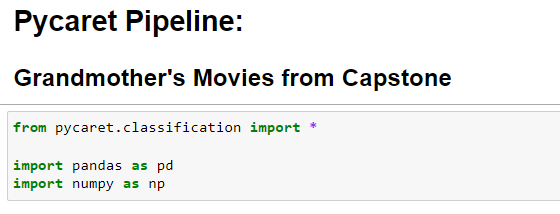

This dataset is from my capstone project:

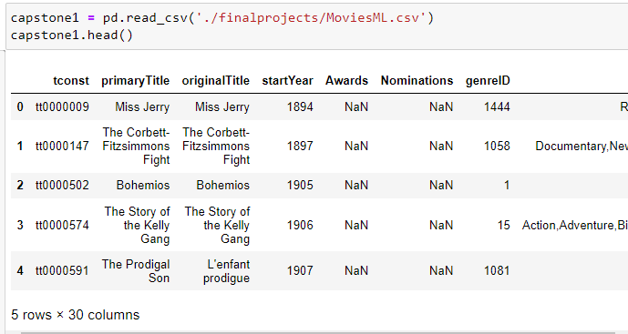

There were quite a few null values in the dataset and after considering the columns in which they were located, I decided to fill them in with zeros to represent the fact that there wasn't any data available:

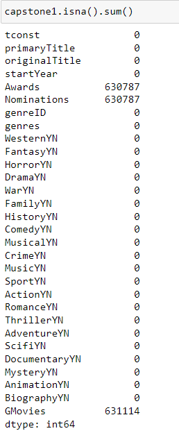

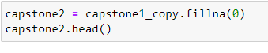

I made a typo in my dataset that I entered in by hand and typed a 2 instead of a 1. Finding this in my Pycaret also allowed me to find this in my original data and fix it before it got to my star schema:

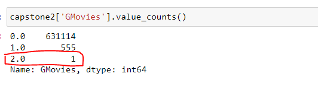

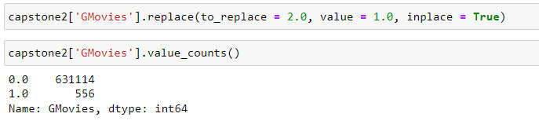

I had a lot of issues with my computer's capacity to run the set up and compare models so I had to limit how many folds were completed. There's further notes about the results in the my Notebook as well:

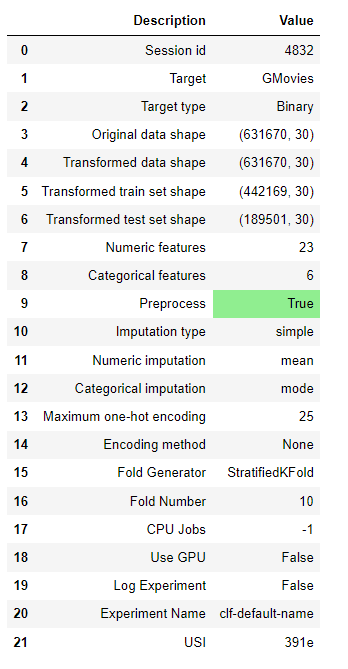

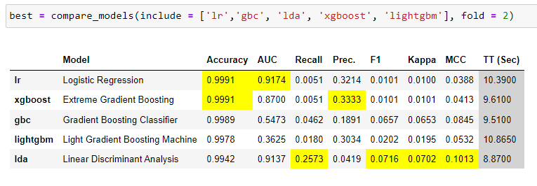

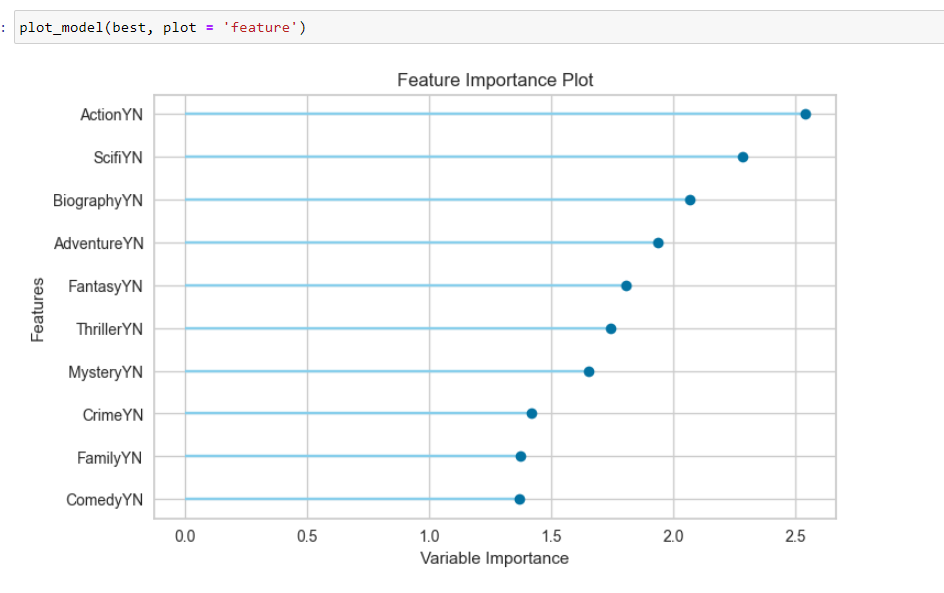

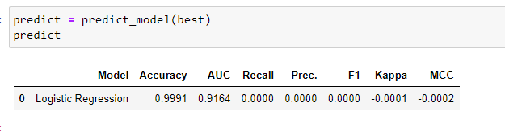

Pipeline saved and ready to go!

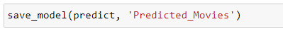

# Yellowbrick: Still image walk-through

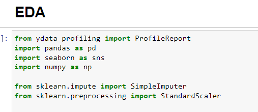

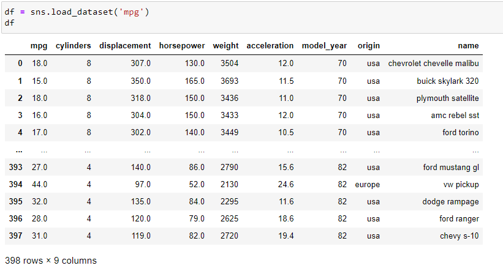

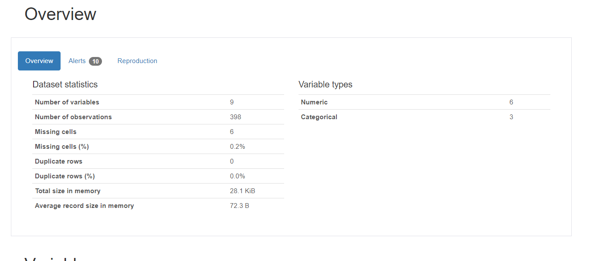

I was fairly proud that I figured out this next code, it took a while for something very simple. But I stepped away and talked it out and figured out how to separate the model_year into the categorical columns.

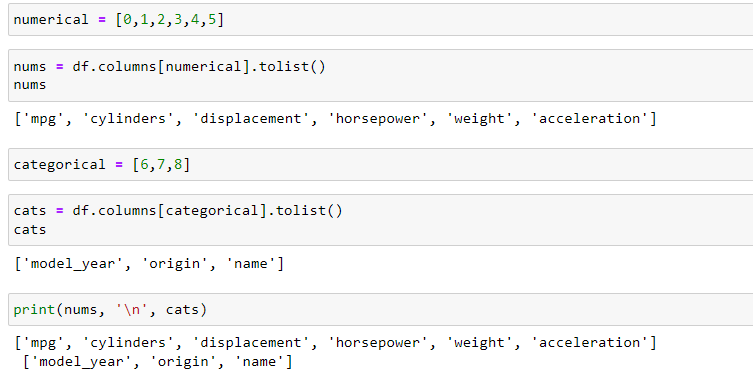

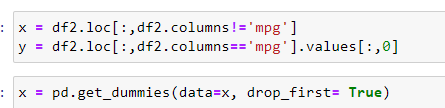

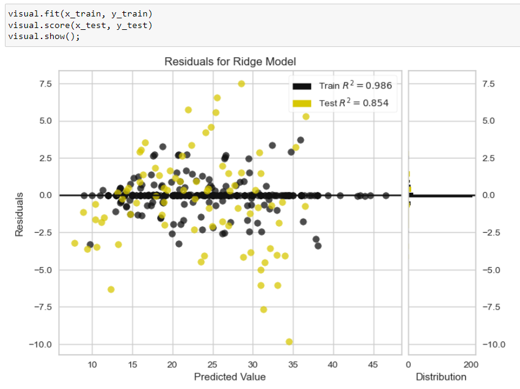

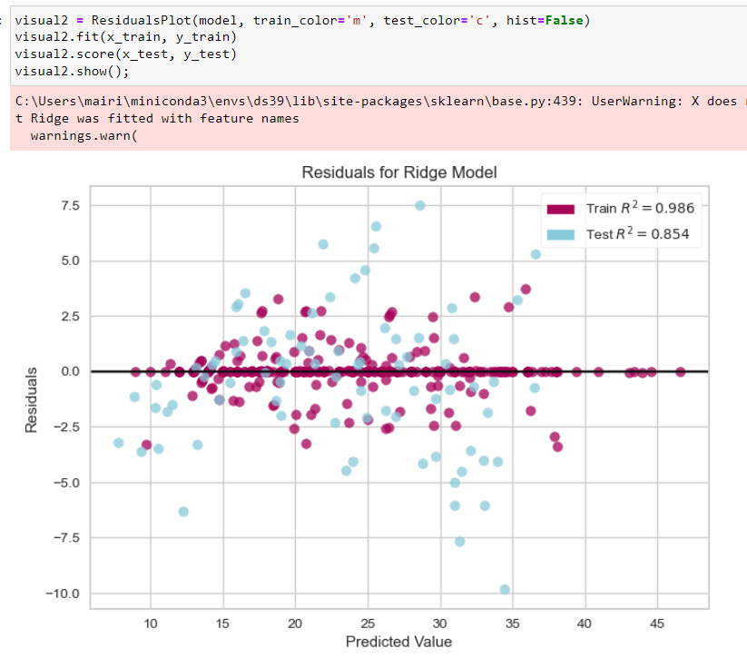

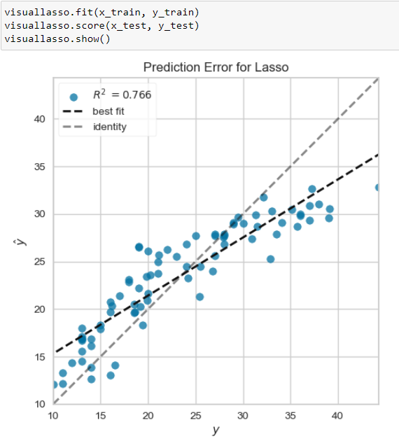
